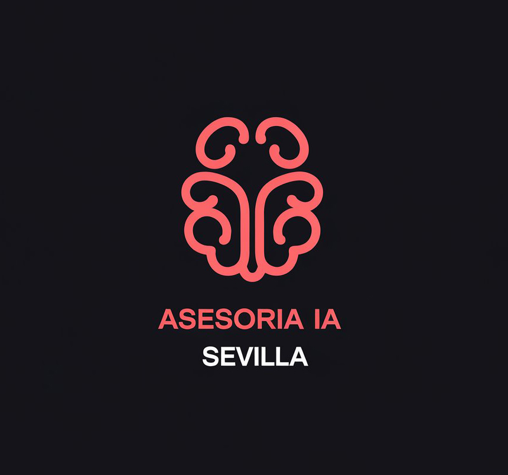

<!DOCTYPE html>
<html lang="es">
<head>
    <meta charset="UTF-8">
    <meta name="viewport" content="width=device-width, initial-scale=1.0">
    <title>IA Sevilla - Asesoría en IA para PYMES</title>
    
</head>
<body>
    <header>
        
        

            <h1>IA Sevilla - Asesoría y Formación</h1>
            
Empoderando a las PYMES con Inteligencia Artificial.

        

    </header>
    
    <section>
        <h2>Sobre Nosotros</h2>
        
Somos especialistas en acercar la Inteligencia Artificial a las pequeñas y medianas empresas, optimizando sus procesos y aumentando su competitividad.

    </section>
    
    <section>
        <h2>Servicios</h2>
        

            

                <h3>Desarrollo de GPTs</h3>
                
Automatización de contenido, generación de respuestas y traducción con IA.

            

            

                <h3>Automatización de Procesos</h3>
                
Optimiza tareas repetitivas como gestión de correos, informes y facturación.

            

            

                <h3>Atención al Cliente con IA</h3>
                
Implementación de chatbots y asistentes virtuales para mejorar la experiencia del cliente.

            

            

                <h3>Formación en IA</h3>
                
Cursos y talleres personalizados sobre Inteligencia Artificial para empresas.

            

            

                <h3>Ofimática con IA</h3>
                
Implementación de Microsoft Copilot en entornos de trabajo para optimizar la productividad.

            

        

    </section>
    
    <section>
        <h2>Beneficios para las PYMES</h2>
        

            

                <h3>Automatización de tareas</h3>
                
Optimiza la gestión de correos, generación de informes y otros procesos repetitivos.

            

            

                <h3>Reducción de costes</h3>
                
Reduce errores y optimiza recursos gracias a la implementación de IA.

            

            

                <h3>Mayor eficiencia</h3>
                
Usa Microsoft Copilot en entornos ofimáticos para mejorar la productividad.

            

            

                <h3>Atención al cliente con IA</h3>
                
Implementación de chatbots y asistentes virtuales disponibles 24/7.

            

            

                <h3>Toma de decisiones basada en datos</h3>
                
Analiza tendencias y toma decisiones informadas con IA.

            

            

                <h3>Mayor competitividad</h3>
                
Permite que las PYMES compitan con grandes empresas con herramientas avanzadas.

            

        

    </section>
    
    <section>
        <h2>Contacto</h2>
        
Email: <a href="mailto:MRIcano@outlook.com" style="color: #ff4d4d;">MRIcano@outlook.com</a>

        
Teléfono: <a href="tel:+34654110527" style="color: #ff4d4d;">654 110 527</a>

        
<a class="boton" href="mailto:MRIcano@outlook.com">Enviar Email</a>

    </section>
    
    <footer>
        
&copy; 2025 IA Sevilla. Todos los derechos reservados.

    </footer>
</body>
</html>
